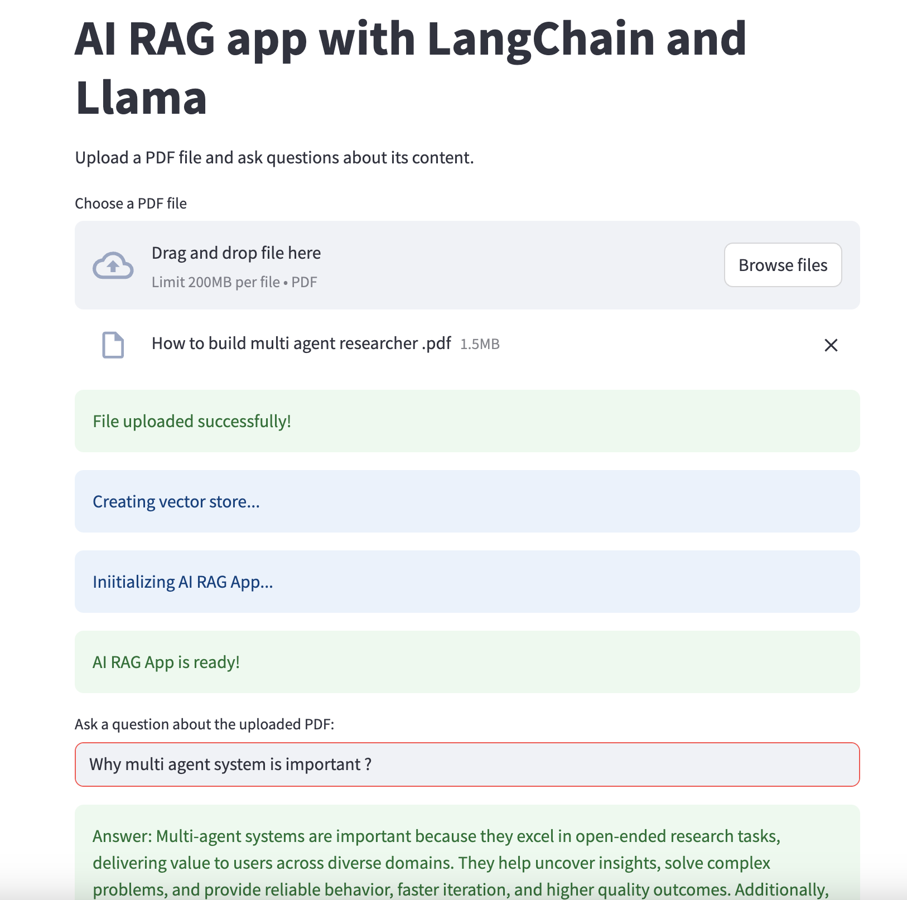

# Langchain RAG AI Application

This AI RAG app allow user to ask question and get answers on their uploaded PDF using local running LLM model. 

## Instruction

Execute following command to the run the AI RAG app:

streamlit run app.py

## Screenshot

